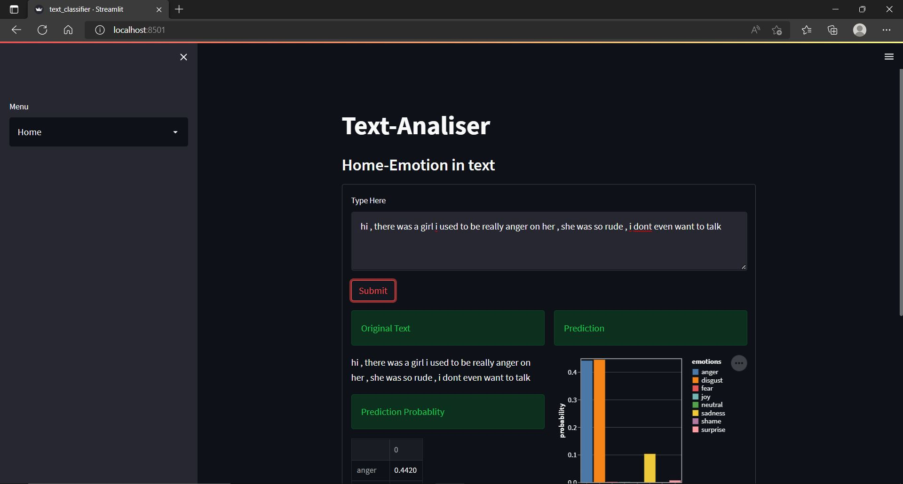
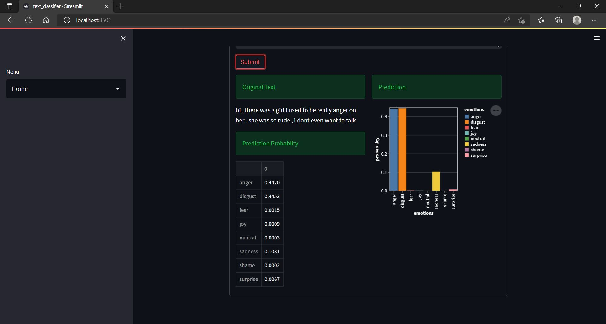
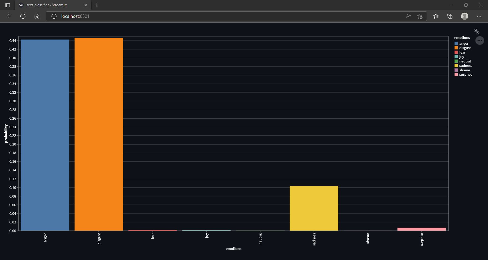
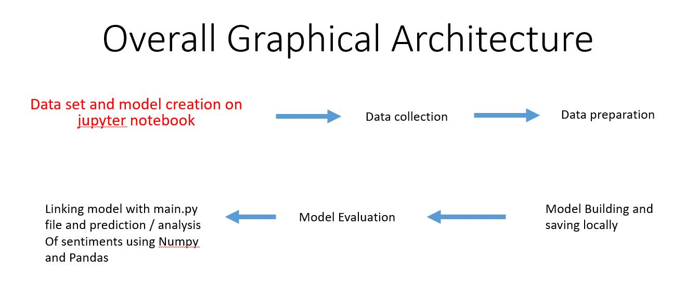

# WEB-APP---Emotion-analyzer-of-text
<h1 align="center">Emotion Analyzer WEB APP</h1>
<h2 align="center">Requirements: -</h2>
<ul align="center">
<li>Anaconda Environment with Spyder IDE and Jupyter Notebook</li>
<li>Modules like Sreamlit Numpy Pandas Sklearn Seaborn Joblib Neattext Altair </li>
<li>if above modules are not installed then install by pip command of the following package</li>
</ul>
 
 
 
 
<h2 align="center">Outputs</h2>

 
 

 
 

 
 
 
 
<h2 align="center">Project Architecture</h2>

<h2 align="center">Method of preparation of Model</h2>
<h4>
<ul align="center">
<li>1st we need to collect dataset and load it as CSV file</li>
<li>Then we need to create a ML model which will involve following this:-
<li>analyzing data</li>
<li>cleaning up by removing unimportant characters like numbers special symbols stop words user handels etc.</li>
<li>Using LINEAR REGRESSION - labeling fitting splitting training and testing our pipeline.</li>
</li>
<li>Examining accuracy of our model by giving random texts for prediction.</li>
<li>Finalizing our model and saving it.</li>
 
</ul>
</h4>
 
 
 
 
<h2 align="center">Preparation of frontend of web app</h2>
<h4>
<ul align="center">
<li>load the model we have createb by giving out absolute path</li>
<li>Define title</li>
<li>Drop down menu for eg - about , home </li>
<li>Eembedding area for text input , bar graph presentation and prediction probablity</li>
<li>defining exceptions for garbage inputs; for eg providing only numbers or giving more than one space etc , which may cause irrelevant predictions.</li>
</ul>
</h4>
 
 
<h1 align="center">The End!</h1>
